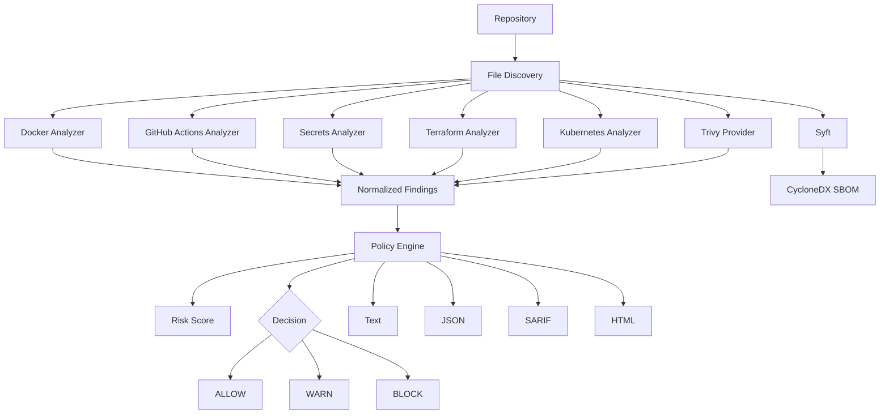

# PipelineGuard

[](https://github.com/abyssalsec/pipelineguard/actions/workflows/ci.yml)
[](https://github.com/abyssalsec/pipelineguard/releases)
[](LICENSE)

**PipelineGuard** is a policy-driven DevSecOps security gate for CI/CD pipelines.

It analyzes application repositories, infrastructure-as-code, container configuration, GitHub Actions workflows, secrets, dependencies and software supply-chain metadata, then converts the results into a single policy decision:

```text
ALLOW
WARN
BLOCK
```

PipelineGuard is developed as a **#ABSL Security Development Project**.

---

## Features

PipelineGuard combines native security analyzers with external security providers.

Native analysis includes:

- Dockerfile security
- GitHub Actions security
- secret detection
- Terraform security
- Kubernetes workload security

External providers add:

- dependency vulnerability scanning with Trivy
- CycloneDX SBOM generation with Syft

The security gate provides:

- configurable policy-as-code
- ALLOW / WARN / BLOCK decisions
- risk scoring
- parallel analyzer execution
- text reporting
- JSON reporting
- SARIF reporting
- HTML security reports
- GitHub Code Scanning integration
- atomic report generation
- deterministic CI exit codes

---

## Architecture



PipelineGuard does not attempt to replace mature vulnerability databases or SBOM engines.

Native checks, orchestration, normalization, policy evaluation, reporting and CI enforcement are handled by PipelineGuard, while specialized providers such as Trivy and Syft can be integrated into the same decision pipeline.

---

## Quick Start

Requirements:

- Linux
- Go
- Git

Optional:

- Trivy
- Syft

Clone and build:

```bash
git clone https://github.com/abyssalsec/pipelineguard.git
cd pipelineguard
make build
```

Run a native repository scan:

```bash
./bin/pipelineguard scan \
  --policy .pipelineguard.yml \
  .
```

Run a full scan with dependency vulnerability analysis and SBOM generation:

```bash
./bin/pipelineguard scan \
  --policy .pipelineguard.yml \
  --trivy \
  --sbom .reports/application.cdx.json \
  .
```

---

## Release Installation

Download the appropriate release archive from GitHub Releases.

Linux AMD64:

```bash
tar -xzf pipelineguard_1.0.0_linux_amd64.tar.gz
sudo install -m 0755 pipelineguard /usr/local/bin/pipelineguard
```

Linux ARM64:

```bash
tar -xzf pipelineguard_1.0.0_linux_arm64.tar.gz
sudo install -m 0755 pipelineguard /usr/local/bin/pipelineguard
```

Verify:

```bash
pipelineguard version
```

---

## CLI

```text
PipelineGuard

Usage:
  pipelineguard scan [options] [path]
  pipelineguard version
  pipelineguard help

Scan options:
  --policy PATH          Policy configuration file
  --format FORMAT        text, json, sarif or html
  --output PATH          Write report atomically to file
  --trivy                Enable Trivy dependency vulnerability provider
  --sbom PATH            Generate CycloneDX JSON SBOM with Syft
  --provider-timeout D   External provider timeout
  --no-banner            Disable interactive startup banner
```

The startup banner is shown only during interactive text-mode execution.

Machine-readable output, redirected output and report files remain clean.

---

## Policy-as-Code

PipelineGuard uses YAML policies.

Example:

```yaml
version: 1

gate:
  block_severities:
    - critical
    - high

  warn_severities:
    - medium

rules:
  docker.root-user: block
  docker.unpinned-base-image: warn

  github-actions.write-all-permissions: block
  github-actions.unpinned-action: warn

  terraform.world-open-ipv4: block

  kubernetes.privileged-container: block

  dependencies.vulnerability.critical: block
  dependencies.vulnerability.high: block
  dependencies.vulnerability.medium: warn
```

Explicit rule actions override the default severity policy.

---

## Native Security Checks

PipelineGuard v1 includes **17 built-in security rules** across five native analyzers.

| Domain | Coverage |
| --- | --- |
| Docker | root execution, unpinned base images |
| GitHub Actions | excessive permissions, unpinned actions, pull_request_target |
| Secrets | AWS access keys, GitHub tokens, private keys |
| Terraform | global IPv4/IPv6 exposure, public IPs, public-read storage |
| Kubernetes | privileged containers, host networking, host PID, non-root execution, unpinned images |

See [docs/RULES.md](docs/RULES.md) for the rule catalog.

---

## Dependency Vulnerabilities

Trivy can be enabled as an external provider:

```bash
pipelineguard scan \
  --trivy \
  --policy .pipelineguard.yml \
  .
```

Trivy findings are normalized into PipelineGuard findings:

```text
dependencies.vulnerability.critical
dependencies.vulnerability.high
dependencies.vulnerability.medium
dependencies.vulnerability.low
dependencies.vulnerability.unknown
```

They are evaluated by the same policy engine as native findings.

---

## SBOM

PipelineGuard can invoke Syft to generate a CycloneDX JSON SBOM:

```bash
pipelineguard scan \
  --sbom .reports/application.cdx.json \
  .
```

The SBOM is generated as a separate software supply-chain artifact.

---

## Reports

Text:

```bash
pipelineguard scan .
```

JSON:

```bash
pipelineguard scan \
  --format json \
  --output pipelineguard.json \
  .
```

SARIF:

```bash
pipelineguard scan \
  --format sarif \
  --output pipelineguard.sarif \
  .
```

HTML:

```bash
pipelineguard scan \
  --format html \
  --output pipelineguard.html \
  .
```

Report files are written atomically with restrictive permissions.

---

## GitHub Actions

A complete GitHub Actions integration example is available at:

```text
examples/github-actions/pipelineguard.yml
```

The workflow:

1. runs PipelineGuard
2. generates SARIF
3. uploads findings to GitHub Code Scanning
4. preserves the SARIF artifact
5. enforces the PipelineGuard exit code

This allows PipelineGuard to operate as a real CI/CD security gate rather than a passive scanner.

---

## Exit Codes

| Code | Meaning |
| ---: | --- |
| `0` | scan completed and policy result is ALLOW or WARN |
| `1` | PipelineGuard execution or provider error |
| `2` | scan completed and policy result is BLOCK |

This makes the tool directly usable as a CI/CD quality gate.

---

## Risk Score

PipelineGuard calculates a repository risk score from normalized findings.

Current severity weights:

```text
CRITICAL  25
HIGH      15
MEDIUM     7
LOW        3
INFO       1
```

The final score is capped at `100`.

The policy decision and risk score are intentionally separate concepts: policy determines whether the pipeline is allowed to continue, while risk score provides a compact security posture indicator.

---

## Testing

The project includes:

- unit tests
- policy-engine tests
- report tests
- mocked Trivy integration
- mocked Syft integration
- secure and insecure repository fixtures
- integration tests
- Go race detector
- gofmt checks
- go vet
- GitHub Actions CI

Run the complete local quality gate:

```bash
make check
make race
```

---

## Releases

Release builds are produced for:

```text
linux/amd64
linux/arm64
```

Each release also contains SHA-256 checksums.

GitHub Releases are built automatically from version tags.

---

## Security Model

PipelineGuard is primarily a **read-only repository security analysis tool**.

It does not remediate findings or modify application source code.

External providers may maintain their own local databases or caches.

Secrets reported by the native secret analyzer are redacted before they are included in PipelineGuard findings.

See [SECURITY.md](SECURITY.md).

---

## Project Status

`v1.x` focuses on repository and CI/CD security gating.

Potential future work includes additional providers, richer policy conditions, repository baselines, attestations and broader software supply-chain verification.

The project does not claim compliance certification against CIS, NIST, PCI DSS, SLSA or another external standard.

---

## License

MIT License. See [LICENSE](LICENSE).

---

**#ABSL Security Development Project**
